A User's Introduction to 

Tutorial version 1.5.0

October 2024

**Contents**

PAMGuard Overview [3](#pamguard-overview)

Tutorial Learning Outcomes [4](#tutorial-learning-outcomes)

Exercise 1. Tutorial Installation [5](#tutorial-installation)

St Andrews University Classroom PC's
[5](#st-andrews-university-classroom-pcs)

Personal Computers [5](#personal-computers)

1.1. Install data and configuration files
[5](#install-data-and-configuration-files)

1.2. Install PAMGuard [5](#install-pamguard)

Exercise 2. PAMGuard familiarisation [5](#pamguard-familiarisation)

Ex 2.1 Launching PAMGuard [5](#launching-pamguard)

Ex 2.2 PAMGuard GUI overview [6](#pamguard-gui-overview)

Ex 2.3 Using the map [7](#using-the-map)

Ex 2.4 Setting up a sound source [8](#setting-up-a-sound-source)

Exercise 3. Running the Click Detector [10](#running-the-click-detector)

Ex 3.1 Tracking clicks manually [11](#tracking-clicks-manually)

Ex 3.2 Tracking clicks automatically
[12](#tracking-clicks-automatically)

Exercise 4. Adding a Spectrogram Display
[14](#adding-a-spectrogram-display)

Ex 4.1 Changing the scales [17](#changing-the-scales)

Ex 4.2 Add plug in displays to the spectrogram
[18](#add-plug-in-displays-to-the-spectrogram)

Exercise 5. Detecting Whistles [19](#detecting-whistles)

Ex 5.1 Configure PAMGuard [19](#configure-pamguard)

Ex 5.2 Configure the FFT [20](#configure-the-fft)

Ex 5.3 Viewing whistle detections [23](#viewing-whistle-detections)

Exercise 6. Mysticete Detection [25](#mysticete-detection)

Ex 6.1 Energy Sum Detector [25](#energy-sum-detector)

Ex 6.2 Spectrogram Correlation Detector
[27](#spectrogram-correlation-detector)

Ex 6.3 Ishmael Matched Filter detector.
[28](#ishmael-matched-filter-detector.)

Ex 6.4 Compare the three detectors [29](#compare-the-three-detectors)

Ex 6.5 Set up the detectors for different species
[29](#set-up-the-detectors-for-different-species)

Exercise 7. Use the Whistle and Moan Detector to detect Baleen whale
calls.
[30](#use-the-whistle-and-moan-detector-to-detect-baleen-whale-calls.)

Exercise 8. Advanced display features [30](#advanced-display-features)

Ex 8.1 Adding further displays to Spectrogram Panels
[30](#adding-further-displays-to-spectrogram-panels)

Ex 8.2 Adding a Radar Display to the User Display panel
[31](#adding-a-radar-display-to-the-user-display-panel)

Exercise 9. Detection during seismic source operation
[32](#detection-during-seismic-source-operation)

Ex 9.1 Loading the sound file [32](#loading-the-sound-file)

Ex 9.2 Adjusting click detection parameters
[33](#adjusting-click-detection-parameters)

Exercise 10. Don't stop now! [35](#dont-stop-now)

#  PAMGuard Overview

Many marine activities involve underwater sound emissions. These may be
a by-product of the activity (e.g. piling or explosives), or a tool
(e.g. air guns used for seismic surveys in oil and gas exploration, or
military/commercial sonar). To mitigate against harm to marine mammals,
observers are often employed to visually scan the sea surface for the
presence of animals. In the event of a sighting, procedures such as
suspension/delay of activities may be implemented to avoid harm.

Visual observations play a vital role, but marine mammals are difficult
to spot on the sea surface, especially when weather and light conditions
are poor. However, many marine mammals produce loud and distinctive
vocalisations, which can often be detected more reliably than visual
cues. For these species, passive acoustic monitoring (PAM) offers an
effective means of detection. Furthermore, the creatures do not need to
be on the surface to be detected.

A basic PAM system consists of a number of hydrophone elements
(analogous to microphones in air, but used for underwater sound)
arranged to form an array, hydrophone signal conditioning/amplification,
a signal acquisition device (e.g. a sound card) and a computer running
PAM software. Sounds in the water are converted by the hydrophones into
electrical signals which are conditioned appropriately and converted
into digital signals for processing by the PAM software.

The PAMGuard project was set up to provide a standard software
infrastructure for acoustic detection, localisation and classification
for mitigation against harm to marine mammals, and for research into
their abundance, distribution and behaviour.

PAMGuard is open-source Passive Acoustic Modelling (PAM) software based
on a platform-independent (e.g. Windows or Linux), flexible, modular
architecture.

This architecture makes it relatively straightforward to incorporate new
modules as they are developed to include additional detection,
localisation, classification and sound visualisation functionalities.
The software offers a versatile software/hardware interface to enable
flexibility in the configuration of in-sea equipment (number of
hydrophones, sensitivities, spacing and geometry).

PAMGuard is a sophisticated software package that can be used by the
expert user to set up industry/research PAM infrastructure. It can also
be configured for operational use by MMO PAM operators. Central to the
software design is a flexible core architecture which allows the
integration of a range of additional plug-ins. For more information on
PAM and PAMGuard please visit *www.PAMGuard.org*.

This tutorial provides an introduction to PAMGuard from a user's
perspective. This involves exercises in setting up and running the
software with a variety of configurations of plug-in modules.

The latest PAMGuard release contains over 38 different plug in modules.
A complete list of these is available on the PAMGuard web site at
[http://www.PAMGuard.org/modules.shtml](http://www.pamguard.org/modules.shtml)

#  Tutorial Learning Outcomes

The purpose of this tutorial is to provide a basic overview of how to
use PAMGuard, including adding and configuring plug-in modules.

The main learning outcomes are:

-   Loading and running PAMGuard configurations

-   Navigating the Graphical User Interface (GUI)

-   Basic Map familiarisation

-   Running and configuring a Click Detector module

-   Adding and configuring User Display panels

-   Adding, configuring and running a Whistle Detector

-   Using "Ishmael" modules for Energy Sum, Spectrogram Correlation and
    Matched Filter detectors.

-   Overlaying detector graphics on display panels

-   Adding and configuring FFT Engines

-   Using spectrogram and radar displays to view detection information

These learning outcomes can be achieved through a series of exercises
that now follow.

The exercises can be seen as a guide, so you're encouraged to experiment
with PAMGuard as you work through each one.

#  Tutorial Installation {#tutorial-installation .Style1}

During these tutorial examples, we assume you are running PAMGuard on a
Windows machine.

In the exercises you will play back sound from a file rather than
receive it in through a sound card. PAMGuard will operate in exactly the
same way as it would if the sound were coming in through the sound card.
If a sound playback module is included in the PAMGuard configuration,
then analysis will be in real time. If a sound playback module is not
included, then PAMGuard will process data as fast as possible.

# St Andrews University Classroom PC's

PAMGuard is available on the Classroom PC's through APPS Anywhere.
Before starting PAMGuard you'll need to move some folders from the read
only L drive to either your personal Home Drive (H:) or Windows (K:).
Performance seems slightly better if copied onto K:

On L: find the folder L:\\Biology\\BL5210\\PAM Practical_171103

This contains three sub folders: TutorialMaps, TutorialSoundFiles and
PAMGuardTutorialHome. The Maps and sound files can remain on the L
drive. However you should copy the PAMGuardTutorialHome folder to your
Home (H:) or Windows (K:) drive. This is because the L drive is read
only, and PAMGuard will need write access in order to modify files in
the PAMGuardTutorialHome folder.

# Personal Computers

## Install data and configuration files

Download the training wav files from
<https://doi.org/10.5281/zenodo.13851130>

Download the configuration files from the PAMGuard web site.

The configuration files will be accessing the downloaded wav files. In
principle, the downloaded files can be anywhere on your computer.
However, when setting up the exercises, the files were in the folder
C:\\PamguardTutorial\\webTutorialDataset. If you put your files in the
same folder, then the tutorials will work "out of the box". Otherwise,
for each exercise, you will have to go into the sound acquisition
settings and re-select the correct file, wherever you've stored it on
your system.

## Install PAMGuard

The examples in this tutorial will work with the latest PAMGuard Version
2.02.13 or higher.

# PAMGuard familiarisation {#pamguard-familiarisation .Style1}

## Launching PAMGuard {#launching-pamguard .Style2}

Launch PAMGuard from Apps Anywhere (or your Windows Start menu on a
personal PC). The first thing to appear will be a splash screen giving
version and license information and a tip of the day. Make the tip go
away and wait for the splash screen to disappear and you will be left
with a dialog like the one below.

<figure>
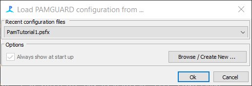
<figcaption>
Figure 1. <em>PAMGuard configuration
dialog</em>
</figcaption>
</figure>

This dialog allows the user to choose from a selection of PAMGuard
configuration files which were either installed with PAMGuard, you
created yourself, or were provided by someone else.

Recently used configurations can be selected from the drop down list. If
the file you want is not available in the list, press the browse button
and find the configuration file on your computer. For this tutorial,
press Browse and navigate to where you've put the
PAMGuardTutorialHomeDrive folder on H:. Select PAMTutorial1.

When *OK* is clicked, the dialog will disappear and the PAMGuard
application will launch. During the launch, the following dialog might
appear.

<figure>
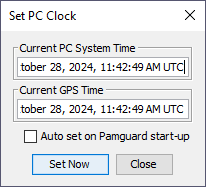
<figcaption>
Figure 2. <em>Set PC Clock Dialog</em>
</figcaption>
</figure>

You should ignore this dialog for this tutorial. After a few seconds it
will disappear. In real operation this would synchronise your PC clock
with the time provided by the GPS system. (Note, that in recent Windows
versions, this functionality may not be available due to security
constraints).

## PAMGuard GUI overview {#pamguard-gui-overview .Style2}

Once launched, the PAMGuard Graphical User Interface (GUI) will look
like Figure 3.

<figure>
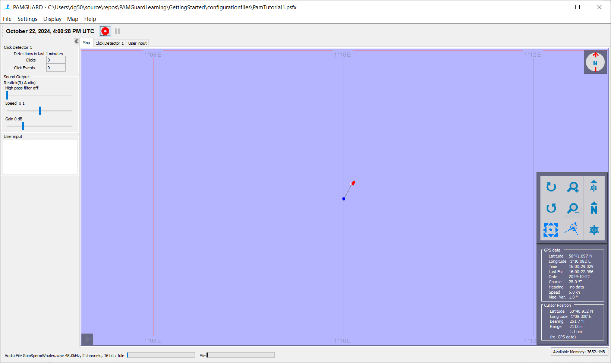
<figcaption>
Figure 3. <em>PAMGuard Graphical User
Interface</em>
</figcaption>
</figure>

The GUI is subdivided as described in the following table.

  -------------- --------------------------------------------------------
  Menu bar       This provides access to many PAMGuard settings and
                 controls, as well as access to the help system. PAMGuard
                 has a dynamic menu bar system, whereby the menu items
                 change according to the current view and settings.

  Clock display  Shows the current time.

  Side panel     The side panel gives quick access to information and
                 controls for currently active modules.

  Tab panel      Tab panels provide access to the main visual interfaces
                 of many of the PAMGuard modules. In this example the map
                 tab panel is shown, which consists of a map, compass and
                 some GPS data etc.

  Status bar     This bar provides information on the current status of
                 PAMGuard, e.g. whether it is running or idle
  -------------- --------------------------------------------------------

Spend some time investigating the user interface.

## Using the map {#using-the-map .Style2}

At this point, PAMGuard should be running with the "PamTutorial1.psfx"
configuration. The configuration file name is always shown in the title
bar of the PAMGuard display. If this is not "PamTutorial1.psfx", exit
and restart PAMGuard with the correct configuration file.

In the tutorial configurations, the GPS data are simulated and the
"vessel" icon will appear on and move over the map display. If you
cannot see this, make sure you have selected the map tab panel by
clicking on its tab and click on the "centre map on ship" map control
button (see table below). GPS data are simulated for demonstration
purposes.

Experiment with the map controls, which have functions as described
below:

+----------+-----------+-----------------------------------------------+
|  | vessel    | represented in the centre of the display by   |
|          |           | the **🠶** icon.                               |
+==========+===========+===============================================+
|  |           | be achieved using the mouse wheel.            |
|  |           |                                               |
+----------+-----------+-----------------------------------------------+
|  |           | display or to 'pan' or drag the display to    |
|          |           | view a different region.                      |
|  |           |                                               |
+----------+-----------+-----------------------------------------------+
|  | or        |                                               |
|  |           |                                               |
+----------+-----------+-----------------------------------------------+
|  |           |                                               |
|  |           |                                               |
+----------+-----------+-----------------------------------------------+

Move the mouse cursor around the map and note that the Latitude and
Longitude of the cursor position is provided and in addition, the range
from the mouse cursor to the host vessel. This is useful for range
estimation.

## Setting up a sound source {#setting-up-a-sound-source .Style2}

First of all you will need a source of sound. PAMGuard modules can
acquire sound data in a number of ways, e.g. sound can be acquired
directly from the system sound card, from some other digital acquisition
device or sound files can be loaded and "re-played".

To load a sound file, your configuration must contain a 'Sound
Acquisition' module. Go to the settings dialog for the sound acquisition
module (Figure 4). You will find this in the Detection-\>Sound
Acquisition menu. In 'Data Source Type' select 'Audio File'. Select the
file of choice (AIF or WAV format) either using the 'Select File' button
or selecting a recent file from the drop down list. The sample rate and
number of channels will be read automatically from the file. If you have
calibration information you can also enter it here, but this is not
required for any of the exercises in this tutorial.

<figure>
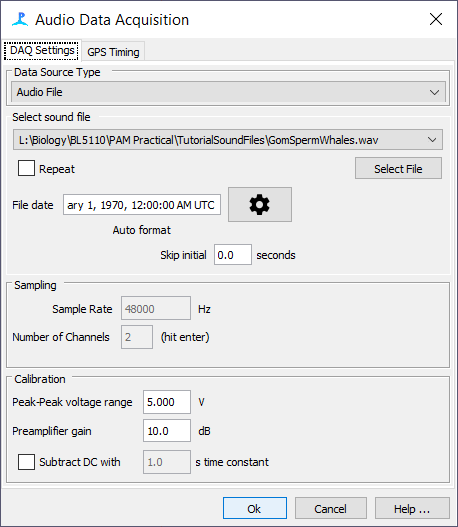
<figcaption>
Figure 4: Sound acquisition configuration
dialog.
</figcaption>
</figure>

# Running the Click Detector {#running-the-click-detector .Style1}

The loaded configuration already has a Click Detector plug-in added.
Clicking on the Click Detector module's tab (Click Detector 1) will
bring forward the main Click Detector interface panel (Figure 5).

<figure>
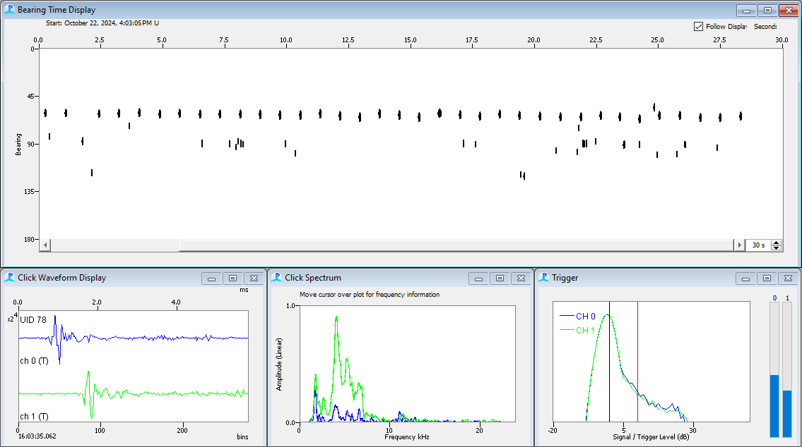
<figcaption>
Figure 5. <em>Click Detector Tab
Panel</em>
</figcaption>
</figure>

The panel has four main components:

+-------------+--------------------------------------------------------+
| B           | Each detected click is shown as a circle or ellipse on |
| earing/Time | the scrolling display. The toolbar at the top of the   |
|             | display can be used to select the type of vertical     |
| display     | axis - bearing, amplitude or inter click interval.     |
+=============+========================================================+
| Click       | The waveform of each detected click appears on the     |
| waveform    | display as it is detected.                             |
|             |                                                        |
| display     |                                                        |
+-------------+--------------------------------------------------------+
| Click       | The power spectrum of each click is displayed as it is |
| spectrum    | detected.                                              |
+-------------+--------------------------------------------------------+
| Trigger     | The trigger window shows the amplitude of the signal   |
| display     | on each channel as a decaying histogram. The vertical  |
|             | red line represents the trigger threshold set in the   |
|             | detection parameters dialog (cross reference). Level   |
|             | meters for each channel are also shown on the right    |
|             | hand side of the trigger window.                       |
+-------------+--------------------------------------------------------+

You can change the duration of the bearing/time display using the arrows
in the bottom right corner of the displays scroll bar.

Start detection by selecting ***Detection ⇒ Start*** from the main menu.
You are now running PAMGuard.

## Tracking clicks manually {#tracking-clicks-manually .Style2}

The bearing time display scrolls with time and detected clicks are
displayed as ellipses. As clicks appear on the bearing time display, the
Click Detector's side panel display (Figure 6) updates the number of
clicks detected in the last 1 minute.

+-----------------------------------+----------------------------------+
| 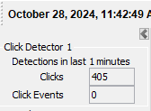          | 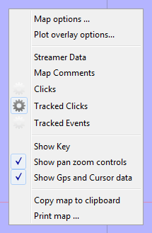         |
|                                   |                                  |
| Figure 6. *Click Detector side    | Figure 7. *Map Panel drop-down   |
| panel display*                    | menu*                            |
+===================================+==================================+
+-----------------------------------+----------------------------------+

To track detected clicks manually, select a click in the Bearing Time
display by right-clicking on it (in fact you can right click anywhere,
which will pause the display, then release the mouse over the click you
want to track). A pop-up menu should then appear where you can select an
id or colour for the whale you are tracking. This will draw a cross on
that click 🞥 to confirm its status as being tracked. Next, click on the
map panel tab to bring forward the map display. Using the right mouse
button (or for Macs, hold the ctrl key and click) click on the map
display to bring up the map detection drawing options. This provides a
selectable list of items which are suitable for drawing on the map. An
example is shown here:

Make sure that "Tracked Clicks" is selected. This will draw the bearing
lines for that click on the map panel, as indicated in Figure 8:

<figure>
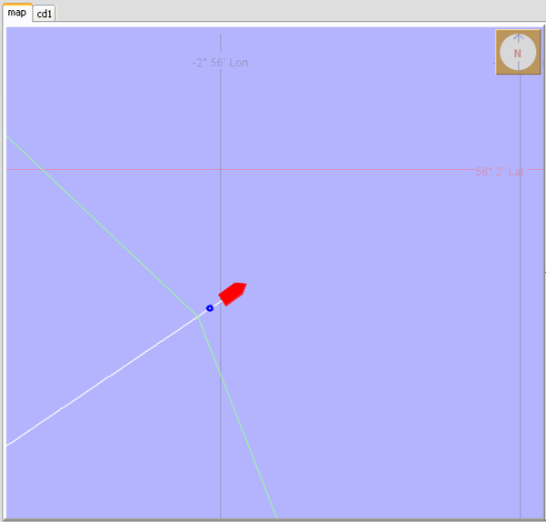
<figcaption>
Figure 8. Tracked click bearing lines plotting on the map
panel
</figcaption>
</figure>

## Tracking clicks automatically {#tracking-clicks-automatically .Style2}

The Click Detector can automatically detect sequences of clicks on a
consistent bearing with a consistent inter click interval. Clicks that
satisfy these constraints are referred to as *Click Trains*.

To enable this feature, select the Click Detector tab panel. Then select
*Click Detection ⇒ Click Train Identification...* from the menu bar.
This will bring up the following dialog:

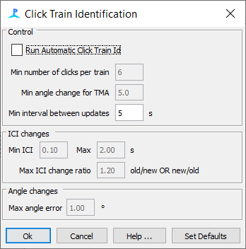

Figure 9. *Click Train Identification Dialog*

Click on the *Run Click Train Id* check box and select *OK*.

Now look at the Bearing Time display. Identified click trains are
indicated by coloured ellipses, as in the Figure 10.

<figure>
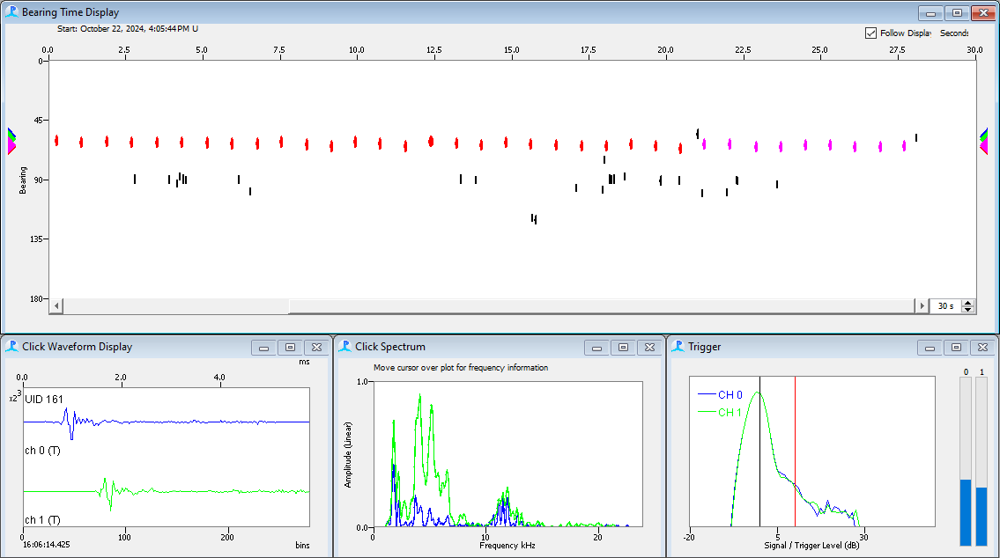
<figcaption>
Figure 10. Click trains plotted on the bearing time
display
</figcaption>
</figure>

Now switch to the map view.

Position the mouse somewhere on the blue map area and press the right
mouse button to display the drop-down detector selection box and make
sure that "Click Trains" is selected.

If a click train reaches sufficient length and the bearing change is
adequate, target motion analysis automatically calculates a range and
bearing to the sound source. The first and last bearing lines associated
with this click train sequence are also automatically displayed on the
map. An example is shown in Figure 11.

<figure>
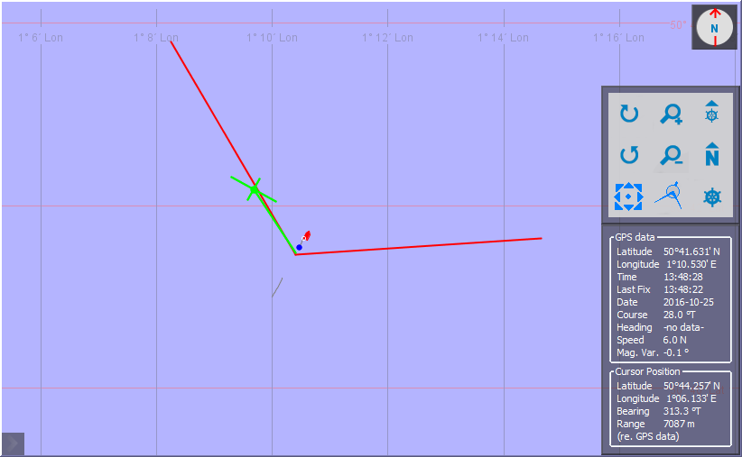
<figcaption>
Figure 11. Click Train range estimates drawn on the
map
</figcaption>
</figure>

Note that the lines terminate at the point of bisection, indicating the
range estimate. Now hover the mouse cursor over this point and observe
the Vessel-cursor range and bearing on the map information panel.

Take some time to experiment with the Click Detector and map views.

Try the program with the file "SpermSurvey.wav", a recording made in the
course of a real seismic survey from a survey vessel of Australia.

Select ***Detection ⇒ Stop*** from the main menu to stop the detector.

# Adding a Spectrogram Display  {#adding-a-spectrogram-display .Style1}

Detections can be viewed in a number of PAMGuard graphics modules. For
this exercise you will firstly use a Spectrogram Display. Spectrogram
Displays are placed on a generic User Display panel, so first of all you
have to add a User Display panel to PAMGuard. To add the new User
Display panel, you will now use the Data Model display. Select ***File ⇒
Show data model**...* from the main menu. This will open the Data Model
display window.

<figure>
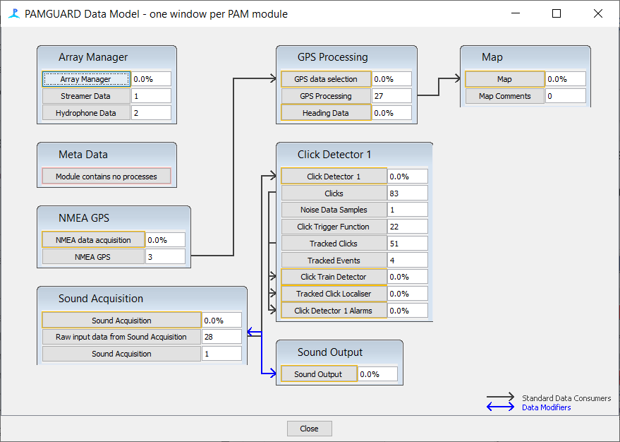
<figcaption>
Figure 12. <em>The PAMGuard Data Model
window</em>
</figcaption>
</figure>

Place your cursor anywhere on an empty space on the data model display
area and, clicking the right mouse button, select ***Add Modules...
⇒Display⇒ User Display*** from the drop-down menus. Enter "User Display
1" as the name of your panel in the new module dialog and click OK. Note
that the User Display module does not appear as part of the data model.
This is because the user display cannot receive or produce data, and
acts merely as a canvas for other displays. Click *Close* at the bottom
of the Data Model display window.

Before adding the spectrogram display, you need to add a module to
calculate FFT's, which are the data to be displayed on the spectrogram.
Go to the menu **File *⇒* Add Modules *⇒* Sound Processing *⇒* FFT
(Spectrogram) Engine**. A dialog will appear asking what you want to
call it. Leave it at the default value and say OK.

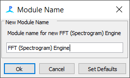

Once you've done this, go to the Settings ***⇒*** FFT (Spectrogram)
engine settings ... to open the FFT dialog.

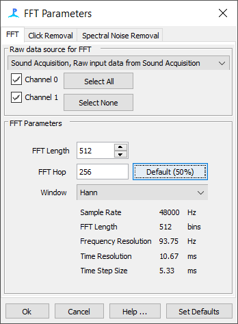

Change the FFT length to 512 points and press the 'Default' button to
set the FFT hop to 256.

To add the Spectrogram Display to the new User Display panel, select the
User Display tab on the tab panel selector. Notice the main menu items
change as you select the various tabs. Select **User *Display ⇒ New
Spectrogram****...* from the main menu.

Click Ok to create the FFT module and Ok again to set the module name
(or enter a different one).

The Spectrogram configuration dialog will then appear:

<figure>
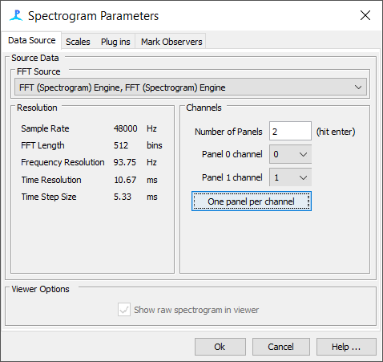
<figcaption>
Figure 13. Spectrogram configuration
dialog.
</figcaption>
</figure>

Enter "2" in the number of panels box. Hit the *Enter* key on the
keyboard to confirm the value and select channel 0 and 1 from the two
channel selection drop-down lists. Click *OK* and the new Spectrogram
Display will appear on the ***User Display 1*** panel. The FFT Engine
will appear in the model view (Figure 12) connected to the sound
acquisition module.

Start the detectors again and you will see a spectrogram scrolling
across the screen. Sperm whale clicks will appear as vertical lines
along the display. You may wish to experiment with different FFT lengths
and other parameters in the FFT Engine configuration dialog. The
spectrogram configuration dialog shown in Figure 13 can be accessed by
right clicking anywhere on the spectrogram display and selecting
'Settings'.

## Changing the scales {#changing-the-scales .Style2}

To change spectrogram time, frequency and amplitude scales, go back to
the dialog (right click and chose "Settings ...") and go to the "Scales"
tab.

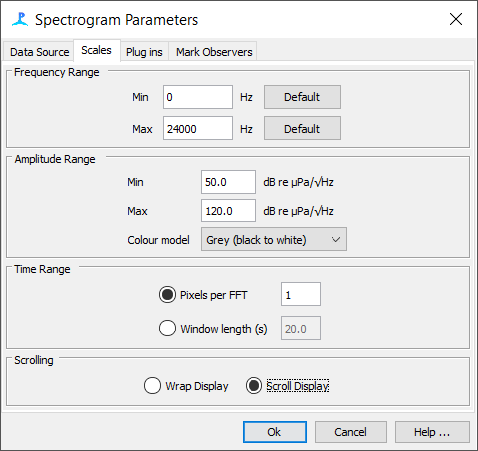

By default, the displayed frequency range will be from 0Hz to half the
sample rate (refer back to the lectures and remember that we can only
process sound data at frequencies up to half the sample rate of the
data, so if the sample rate is 48kHz, we can process sounds up to 24
kHz).

The amplitude range required to get a reasonable resolution on the
amplitude (colour) scale will depend on the hydrophone sensitivity and
the amount of noise in the system. If you set the values too high or too
low, then you may end up with a completely black or completely white
display since many of the values to be displayed will be outside the
range you have specified. You can change the display colours -- but
while the coloured spectrogram might look nice, it will be harder to see
the detections which are drawn on top of the display once we start to
add detection data in later exercises.

By default, it's best to use a single pixel of the display for each FFT
slice in time. For a 512 point FFT and a 48kHz sample rate, this
generally means less than 10s of data per screen. Increasing the time
range beyond this will force the software to compress the spectrogram
image and short transient sounds may no longer be visible.

You can chose to scroll or wrap the spectrogram. Scrolling looks better,
but if you're using a module which requires you to mark or select parts
of the spectrogram with the mouse, then it's almost impossible to mark
the right bit when it's scrolling, so the wrapping option is easier to
use.

## Add plug in displays to the spectrogram {#add-plug-in-displays-to-the-spectrogram .Style2}

Many PAMGuard modules have plug in displays which attach to the bottom
of the spectrogram displays. Right click on the spectrogram to access
the spectrogram configuration dialog. Go to the 'Plug ins' Tab (Figure
14) and select one or two of the available plug in displays. Start
detection and you will see additional display units at the bottom of the
spectrogram display. Some plug ins have additional options which can be
accessed by right clicking on specific plug in panels.

<figure>
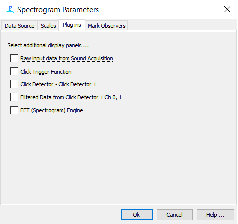
<figcaption>
Figure 14. Spectrogram plug ins
configuration.
</figcaption>
</figure>

# Detecting Whistles {#detecting-whistles .Style1}

PAMGuard contains two different detectors that can be used to detect
Whistles -- tonal calls from a variety of Odontocete species. The first
is called simply the "Whistle Detector" and the second the "Whistle and
Moan Detector". The Whistle and Moan detector is a lot better than the
older Whistle detector at detecting calls, so you should always use that
one. We've left the older module in though, just in case anyone has it
set up perfectly for a particular purpose and doesn't want to change it.

As its name implies, the Whistle and Moan detector can be used to detect
both odontocete whistles, which are generally at frequencies of between
a couple of kHz and the low 10's of kHz and also low frequency moans
from baleen whales.

## Configure PAMGuard {#configure-pamguard .Style2}

Start from the settings file used for click detection
'PamTutorial1.psfx'. The module will already have the click detector in
it, but that's OK -- PAMGuard can run multiple detectors at the same
time.

First, ensure that Detection mode is not active **(*Detection ⇒
Stop*).**

Load the sound file "whistles.wav**"** (See exercise 1.4).

Next, we will add a Whistle and Moan Detector module to PAMGuard. Select
***File ⇒ Add Modules...⇒ Whistle and Moan Detector*** from the main
menu. The following dialog will appear if an FFT module is not already
included in the configuration:

<figure>
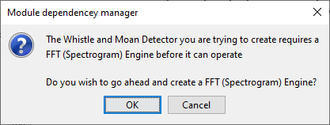
<figcaption>
Figure 15. <em>FFT Engine creation
dialog</em>
</figcaption>
</figure>

## Configure the FFT {#configure-the-fft .Style2}

Whistle detector modules require spectrogram data to work. FFT modules
provide spectrogram data and PAMGuard knows at this point that no FFT
data producing modules are present. PAMGuard therefore asks if you would
like to make one. Click *Yes*. A new dialog will appear asking you to
name the FFT Engine module.

<figure>
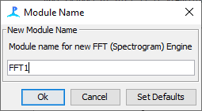
<figcaption>
Figure 16. <em>Naming the FFT Engine
module</em>
</figcaption>
</figure>

In this dialog, enter ***FFT1*** as the name for the new FFT Engine and
click OK.

It will then ask the name of the new Whistle and Moan detector:

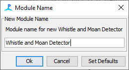

Click OK (or change the name if you want to !).

*Configure the FFT module*

Next you need to configure the FFT module so that it's providing exactly
the right type of data to the Whistle and Moan Detector. It need to be
set up quite carefully for the Whislte and Moan detector to operate
correctly.

From the Detection menu, select **FFT1 Settings** and the following
dialog will appear:

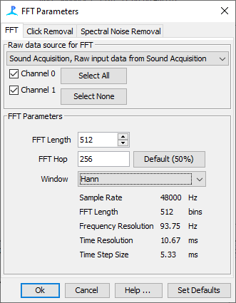

On the first tab, make sure that it's connected to the correct sound
source (Raw input data from Sound Acquisition), that both channels are
selected and that the FFT length is set to 512 points and the FFT hop to
256 points (when you adjust the FFT length and hop, note how the
Freqeuncy and Time resolution values change !).

Next, you need to set up some noise reduction methods, which operate on
the Spectrogram data before it can be used to detect the sounds. On the
other two tabs, select everything !

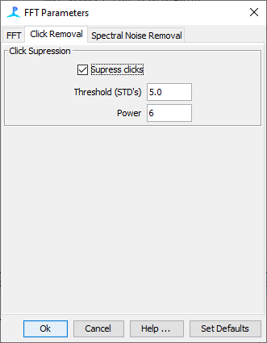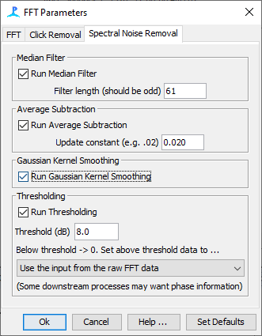

Once you've done this, you can close this FFT dialog and proceed to
setting up the Whistle Moan detector itself.

From the Detection menu, select **Detection \> Whistle and Moan
Detector**.

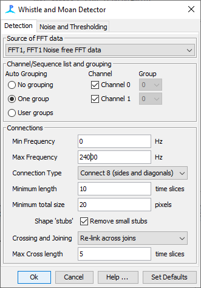

There are several things you'll need to change on this dialog.

First set the source of FFT data to be "FFT1 Noise free FFT data.

Select one channel group, and include both channels in that group (for
more on channel grouping and how channel groups are used to measure
bearings to detected sounds, see the help file).

Set the Max frequency to 24000Hz (24kHz).

And click Ok to save the configuration.

Now that you have changed the PAMGuard model configuration, click

***File ⇒ Save configuration as**...* and save the configuration as
"clickAndWhistleDetectors.psfx"**.** Close down PAMGuard **(*File ⇒
Exit*)** and re-launch the application. Choose
"**clickAndWhistleDetectors.psfx**" from the ***Load PAMGuard
configuration from**...* dialog and click *OK*.

## Viewing whistle detections {#viewing-whistle-detections .Style2}

You've probably already got a Spectrogram display from Exercise 4. If
not, go back to Exercise 4 and add one now.

Start detection ***Detection ⇒ Start*** and the two spectrogram panels
will show the spectrogram data in real time.

<figure>
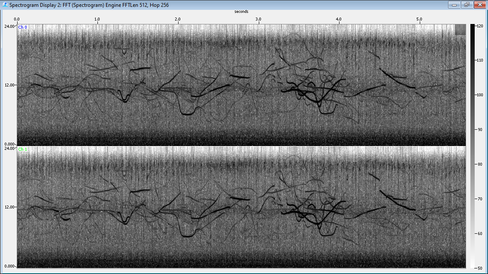
<figcaption>
Figure 22. A Spectrogram panel display
</figcaption>
</figure>

To view the whistle contours on the display, right click anywhere on the
spectrogram and select "Whistle and Moan Detector Connected Regions".

Run the detector and you should get something looking like this:

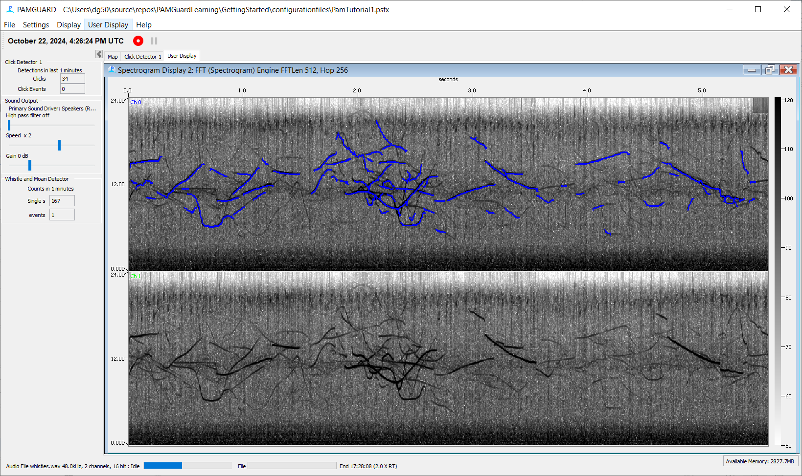

# Mysticete Detection {#mysticete-detection .Style1}

This set of exercises will demonstrate three different detectors which
have been ported to PAMGuard from Dave Mellingers Ishmael software.

1.  Energy sum

2.  Spectrogram Correlation

3.  Matched Filtering

The energy sum detector takes a spectrogram and sums the energy in a
given frequency band. It's sensitive to any sounds in that frequency
band and would not, for example, be able to tell the difference between
an upsweep and a downsweep. Energy sum detectors are extremely simple,
but are good for making a first pass through a data set, highlighting
areas that deserve closer scrutiny. (Low Processor Gain)

Spectrogram correlation also uses the output of a spectrogram, but
rather than simply adding the energy in a given frequency band, the
spectrogram 'image' is convolved with (multiplied by) a spectrogram
image of a sample sound. The closer the match of the image to the sample
sound, the higher the detector output. Spectrogram correlation detectors
should be able to tell the difference between an upsweep and a
downsweep. (Moderate Processor Gain)

A matched filter uses the raw data, which is convolved by a template of
a sample sound. The better the match of the sample sound, the higher the
detector output. Matched filters are in fact the optimal solution for
the detection of a known signal in random (Gaussian noise). However, if
the template is not an exact match, they perform poorly. (High processor
gain).

To start this series of exercises, exit PAMGuard, then restart it and
load up the configuration file PamTutorial2.psfx. This contains a basic
configuration containing a sound acquisition module (which will read the
sound files), FFT Engine and a spectrogram display. During the exercises
you will add the three detectors and then run them on a variety of
sounds.

All exercises start by using the file Blue Whale-Atlantic.wav file. This
should be reposautomatically loaded when you start the PamTutorial2.psfx
configuration. PAMGuard can analyse this low frequency sample file
extremely quickly. To slow it down, so that you can see what's going on
on the screen, a playback module has been included in the configuration
which plays the sounds at several times real time for the 100Hz sample
file.

## Energy Sum Detector {#energy-sum-detector .Style2}

From the File/Add Modules/Detectors... menu, add an Ishmael energy Sum
detector. From the Detection settings menu, configure the module as
shown in Figure 17.

<figure>
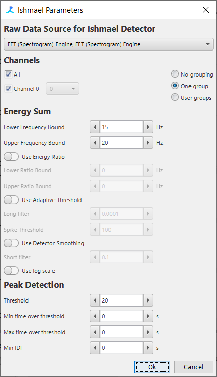
<figcaption>
Figure 17. Energy sum configuration
dialog.
</figcaption>
</figure>

From the spectrogram plug-in options (right click on the spectrogram
display), select the 'Ishmael energy Sum Graphics' and start detection.
You should see the detector output displayed below the spectrogram as
shown in Figure 18.

<figure>
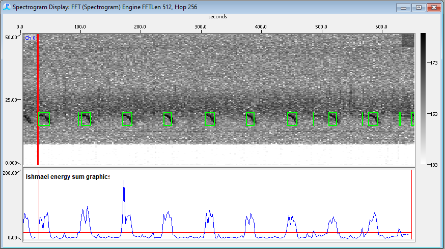
<figcaption>
Figure 18. Blue whale calls and Ishmael Energy sum
detector output.
</figcaption>
</figure>

## Spectrogram Correlation Detector {#spectrogram-correlation-detector .Style2}

From the File/Add Modules/Detectors... menu, add an Ishmael Spectrogram
Correlation detector. From the settings menu, configure the module as
shown in Figure 19.

<figure>
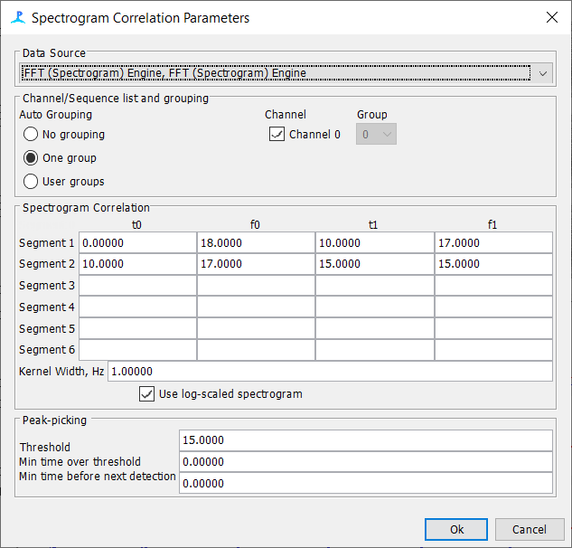
<figcaption>
Figure 19. Spectrogram Correlation configuration
dialog.
</figcaption>
</figure>

Select the appropriate plug in for the spectrogram display and run the
detector again (Figure 20).

<figure>
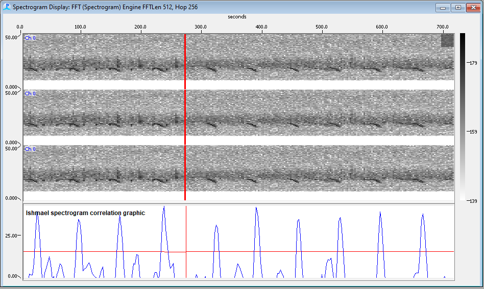
<figcaption>
Figure 20. Blue whale calls and Ishmael Spectrogram
Correlation detector output.
</figcaption>
</figure>

## Ishmael Matched Filter detector.  {#ishmael-matched-filter-detector. .Style2}

From the File/Add Modules/Detectors... menu, add an Ishmael Matched
Filtering detector. From the settings menu, configure the module as
shown in Figure 21. Note that the name of the kernel sound file is
blueTemplate.wav and is included with the tutorial dataset.

<figure>
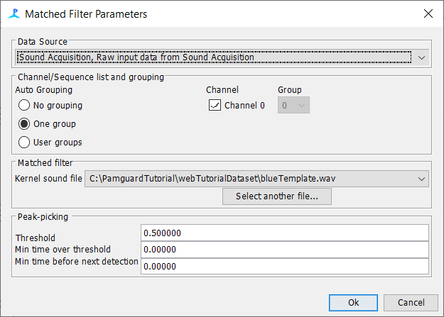
<figcaption>
Figure 21. Matched Filter configuration
dialog.
</figcaption>
</figure>

Select the appropriate plug in for the spectrogram display and run the
detector again (Figure 22). The output of the detector is a number
varying between 0 and 1. Note that the peak detector output
corresponding to the second call reaches this value. This is because the
template for the matched filter was taken from this second call, to the
match is perfect !

<figure>
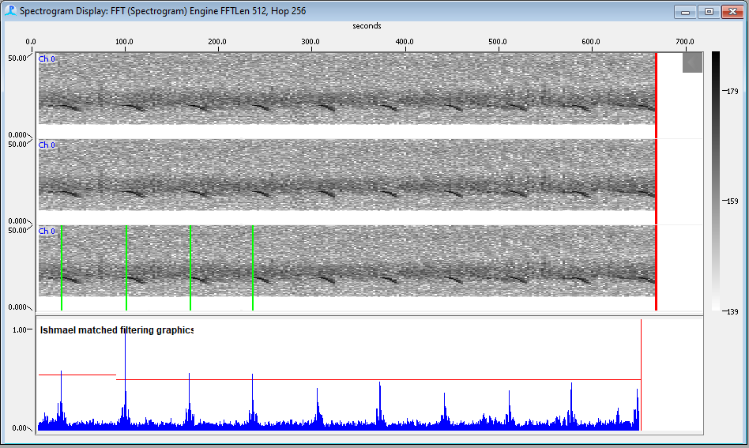
<figcaption>
Figure 22. whale calls and Ishmael Matched Filter
detector output
</figcaption>
</figure>

## Compare the three detectors {#compare-the-three-detectors .Style2}

You should easily be able to run all three detectors simultaneously and
display the plug ins for each at the bottom of the spectrogram. Which
detector is best ? The answer is that it's impossible to say unless you
test them with multiple sound files containing both blue whale calls and
a variety of noise sources, count the number of false detections and the
number of missed detections for varying detection thresholds and create
ROC curves for the three detectors.

## Set up the detectors for different species {#set-up-the-detectors-for-different-species .Style2}

Try the detectors with some of the other blue whale and humpback sound
files. Try to reconfigure the energy sum and spectrogram correlation
detectors for some of the other sounds files. You will be able to test
the matched filter on other sound files, but will not be able to
reconfigure it since the creation of a suitable template file is beyond
the scope of this tutorial.

Try to configure energy sum and spectrogram correlation detectors for
some of the sperm whale and whistle files in the tutorial dataset.

# Use the Whistle and Moan Detector to detect Baleen whale calls.  {#use-the-whistle-and-moan-detector-to-detect-baleen-whale-calls. .Style1}

Go back to one of the configurations you were using to detect Baleen
whale sounds with the Ishmael detectors and try to set up the Whistle
and Moan detector to find these sounds as well.

# Advanced display features {#advanced-display-features .Style1}

There are more display types available in PAMGuard which will be
explored here.

## Adding further displays to Spectrogram Panels {#adding-further-displays-to-spectrogram-panels .Style2}

It is often useful to view multiple data and detection types
simultaneously. For example, various detector modules active in PAMGuard
can draw detections on the Spectrogram panels. While detection is
running, right-click over a spectrogram panel and choose "Clicks".
Detected clicks will now be plotted on the panel as red circles on the
top of the plot.

In addition, plots can be added to the bottom of the Spectrogram panel.
Right-click over the spectrogram display and choose *Settings...* from
the menu. Now click on the ***Plug-in*** tab. Select additional plug-in
display panels by clicking on the check boxes for ***Raw input data from
Sound1*** and ***Click Detector ⇒ Click Detector 1*. Click *OK*.**

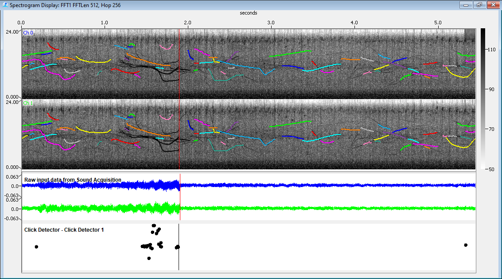

Figure 24. Raw data and Click Detector plugin panels added to a
spectrogram display

As illustrated in the figure above, the raw sound waveforms are plotted
and also a compact version of the Click Detector display is shown.

## Adding a Radar Display to the User Display panel {#adding-a-radar-display-to-the-user-display-panel .Style2}

We will now add a "Radar" type display to the User Display. Radar
display windows can be used to display range, amplitude and bearing
information to detected sounds. To add the Radar Display to the User
Display panel ***User Display 1*,** select **the *User Display 1*** tab
on the tab panel selector. Select ***User Display ⇒ New Radar
display**...* from the main menu.

Since many detectors, particularly those using simple linear
hydrophones, produce ambiguous bearing information, it is possible to
display either the full display or only one half of the display. We will
display a half display called *RD1*, so type in the name and select
***Right half only*** from the Style option drop-down list. Once the
Radar Display is on User Display 1, select, ***User Display ⇒ Arrange
Windows... ⇒ Tile* *Vertical*** from the main menu. The display should
look something like Figure 25.

<figure>
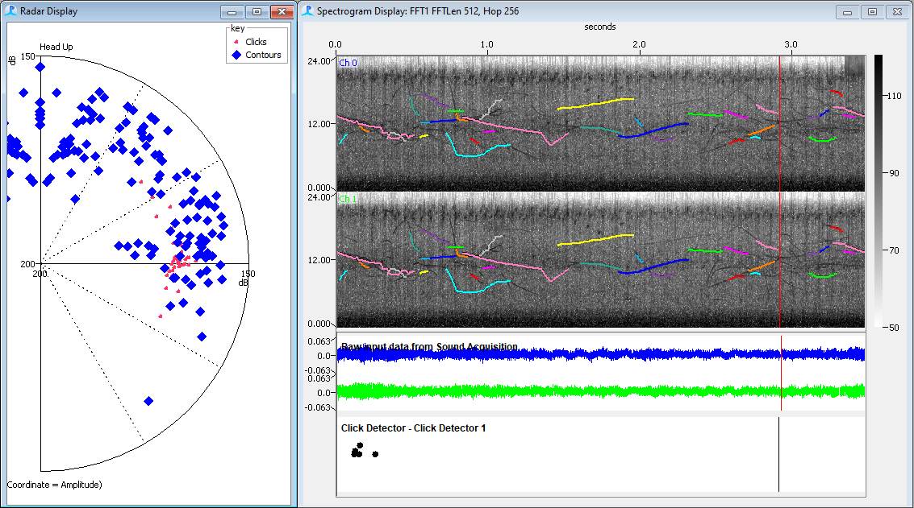
<figcaption>
Figure 25. A Radar display added to the User Display
Panel
</figcaption>
</figure>

Right-click over RD1 and choose **Settings... *⇒* Detectors**. From the
Detectors tab, select the ***Show Detector Data*** settings as indicated
in Figure .

<figure>
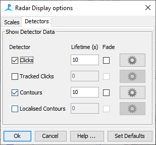
<figcaption>
Figure 26. Detector selection and lifetime settings for
Radar Display
</figcaption>
</figure>

Click ***OK*.** This will set the radar plot to display Clicks, Tracked
Clicks and Whistle detections for 1, 20 and 1 seconds respectively.
Experiment with the plot settings and, when you have finished, select
***Detection ⇒ Stop*** from the main menu in preparation for the next
exercise.

# Detection during seismic source operation {#detection-during-seismic-source-operation .Style1}

## Loading the sound file {#loading-the-sound-file .Style2}

First load the sound file "spermWhalesPlusSeismic.wav".

This is a recording of sperm whale vocalisations taken during an active
seismic survey. The presence of a significant sound source, such as
firing air guns has implications for the operation of detection
algorithms.

You will notice an artefact on the central axis (indicting no time delay
between channels). This is noise picked up after the seismic pulse which
has been gated out.

Here we will investigate changing the Click Detector settings in an
effort to reduce the adverse effects of the unwanted noise.

Select ***Detection ⇒ Click Detector 1 ⇒ Detection Parameters**...* from
the main menu. Click on the Set defaults button to restore the detectors
settings to their default values. Start Detection (***Detection ⇒
Start*)** and observe the Click Detector tab panel displays. You should
see something like this:

<figure>
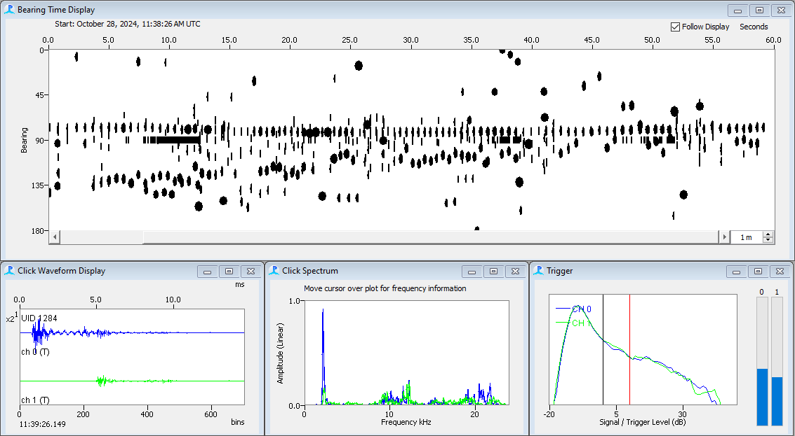
<figcaption>
Figure 23. Click Detector display example for noisy
seismic data
</figcaption>
</figure>

Notice the rapid click detections associated with the electrical noise
on the 90° bearing.

## Adjusting click detection parameters {#adjusting-click-detection-parameters .Style2}

Right click on the ***Click Detector Bearing Time Display*** and select
'Amplitude/Time' This changes the Y-axis of the plot to represent the
amplitude of detected clicks. Notice that the rapid clicks consistently
appear at lower amplitude to the majority of the rest of the click
detections (Figure 24). If all of the clicks appear at the top of the
display, you may need to adjust your computer's mixer settings to reduce
the amplitude of the captured sound. You can also adjust the amplitude
scaling of the display by right clicking and invoking the settings
dialog.

<figure>
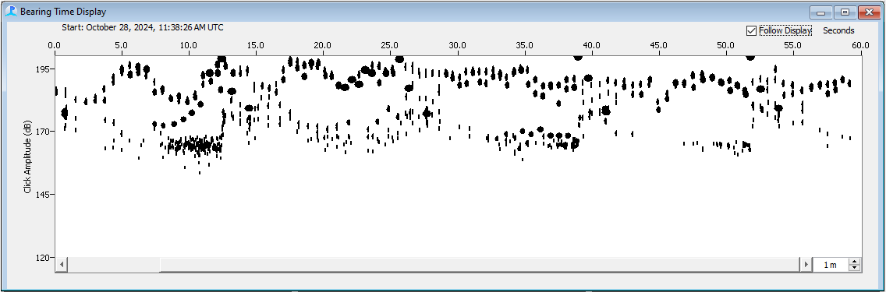
<figcaption>
Figure 24. Plotting click amplitude versus
time
</figcaption>
</figure>

<figure>
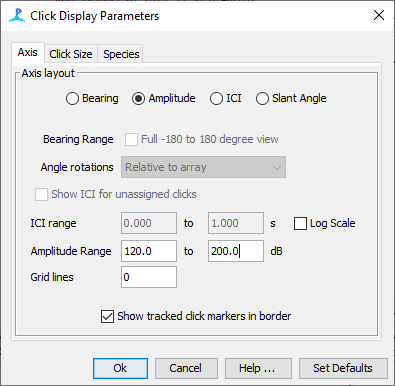
<figcaption>
Figure 25. Adjusting the amplitude scaling for the Click
Detector Amplitude display
</figcaption>
</figure>

We will now adjust the click trigger threshold such that the Click
Detector will not trigger for these lower amplitude clicks. Again select
***Detection ⇒ Click Detector 1 ⇒ Detection Parameters...*** from the
main menu. This time, increase the *Threshold* setting above the default
setting of 10.0 dB. This will increase the level above the measured
background which must be exceeded by clicks to become detection
candidates.

Click ***OK*** and observe the Click Detector display. Wait for the
algorithm to settle down with the new settings (up to 10 seconds).

If your setting is too high, then genuine clicks may not be exceeding
the threshold and the click display will look rather sparse. If the
setting is too low, you will still be seeing the interference clicks.
Experiment with this setting until you are happy with the results.

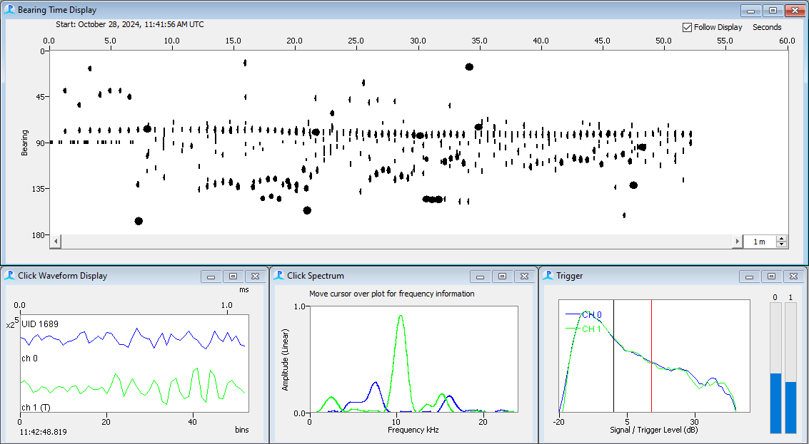

Figure 30. Results of adjusting Click Detector trigger threshold

# Don't stop now! {#dont-stop-now .Style1}

This tutorial has given you a brief introduction to setting up and using
PAMGuard. There are more PAMGuard plug-ins and features for you to try
out.

Here's some ideas to get you going:

-   Set up a Sound Recorder module and trigger recordings from click
    trains.

-   Use a decimator to provide lower sample rate data to a second
    spectrogram.

-   Display smoothed spectral data on a spectrogram.

Try these out with the other example sound data files.

The PAMGuard developers are keen to know what you think of the software,
so any comments (good or bad!) are very welcome. Also, if you think this
tutorial can be improved in any way, please let us know at
[feedback@PAMGuard.org](mailto:feedback@pamguard.org).

Thanks for taking the time to do this tutorial. Hopefully you've enjoyed
this and learned some more about PAMGuard. You can contact us and keep
up with PAMGuard news through visiting
[www.PAMGuard.org](http://www.pamguard.org).
